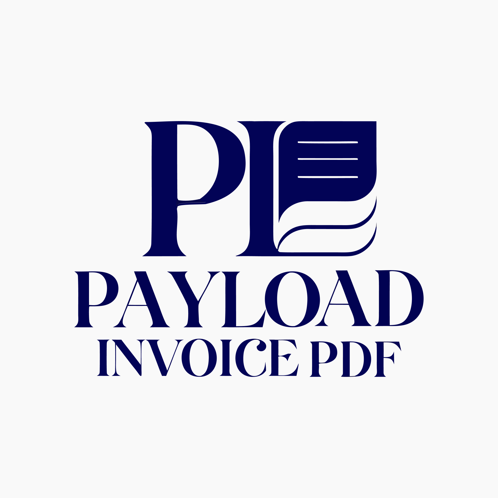

<p align="center">
  
</p>

<p align="center">
  Professional PDF invoices and quotes for Payload CMS
</p>

<p align="center">
  <a href="https://www.npmjs.com/package/payload-invoicepdf"></a>
  <a href="https://github.com/payload-invoicepdf/payload-invoicepdf/blob/main/LICENSE"></a>
  
</p>

---

A Payload CMS 3.x plugin that adds complete invoice and quote management — JSX-based PDF templates, email sending, quote acceptance workflows, customer autofill, and a rich admin UI — out of the box.

## Features

- **PDF Generation** — 4 built-in templates (Classic, Modern, Minimal, Bold) rendered with `@react-pdf/renderer`. Create custom templates with JSX.
- **Invoices & Quotes** — Full collections with auto-numbering (`INV-2026-0001`), status tracking, line items, tax calculation, and due dates.
- **Email Sending** — Send invoices/quotes via email with PDF attachments or live document links. Tracks send history per document.
- **Quote Acceptance** — Clients receive a secure link to view, accept, or decline quotes. Accepting auto-creates a draft invoice.
- **Customer Autofill** — Connect your existing customer collection. Select a customer and client fields fill automatically.
- **Product Autofill** — Link your product catalog. Add a product to a line item and description + price populate instantly.
- **PDF History** — Every generated PDF is stored and versioned. Browse and download previous versions from the admin.
- **Admin UI** — Tabbed document views, sidebar actions (download, generate, send, convert), email composer drawer, and related document links.

## Quick Start

```bash
npm install payload-invoicepdf
# or
pnpm add payload-invoicepdf
```

```ts
// payload.config.ts
import { invoicePdf, builtInTemplates } from 'payload-invoicepdf'

export default buildConfig({
  // ...your config
  plugins: [
    invoicePdf({
      productCollection: 'products',
      productFieldMapping: {
        name: 'name',
        price: 'price',
      },
      templates: builtInTemplates,
    }),
  ],
})
```

That's it. You now have `invoices` and `quotes` collections with PDF generation, a `shop-info` global for your company details, and sidebar buttons for downloading, generating, and emailing documents.

## Built-in PDF Templates

| Template | Style |
|----------|-------|
| **Classic** | Traditional business invoice with clean lines |
| **Modern** | Sleek, minimal layout with accent colors |
| **Minimal** | Ultra-clean whitespace-heavy design |
| **Bold** | Strong color header, high contrast |

Select a template per document, or set a default. Build your own with `@react-pdf/renderer` — see the [Custom Templates Guide](documentations/custom-templates.md).

## Documentation

| Guide | Description |
|-------|-------------|
| [Getting Started](documentations/getting-started.md) | Installation, configuration, and your first invoice |
| [Configuration Reference](documentations/configuration-reference.md) | All config options with examples |
| [PDF Templates](documentations/pdf-templates.md) | Built-in templates and how to select them |
| [Custom Templates](documentations/custom-templates.md) | Build your own PDF and email templates with JSX |
| [Email Sending](documentations/email-sending.md) | Email setup, templates, and send history |
| [Quote Acceptance](documentations/live-document-link.md) | Secure link workflow for client quote responses |
| [Customer Autofill](documentations/customer-autofill.md) | Connect your customer collection for autofill |

## Requirements

- Payload CMS `^3.79.0`
- Node.js `^18.20.2` or `>=20.9.0`
- A `media` collection with uploads enabled (or specify a custom `mediaCollection`)

## License

MIT
